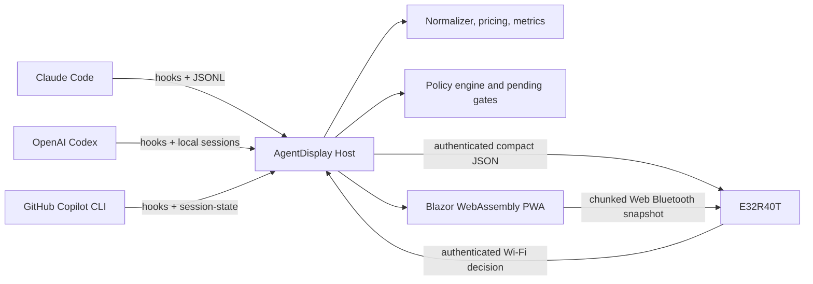

# Architecture

## Components

`AgentDisplay.Contracts` contains versioned host, PWA, hook, and device models.

`AgentDisplay.Core` contains defensive provider parsing, token and pricing calculations, cache metrics, forecasts, redaction, deterministic policies, demo data, and compact-device mapping.

`AgentDisplay.Host` owns local files, optional provider credentials, scans, live state, pairing, hook installation, HTTP APIs, and device pushes. It serves the compiled Blazor application from the same origin.

`AgentDisplay.Web` is an installable Blazor WebAssembly PWA. It provides overview, session and turn detail, approval decisions, display pairing, directory configuration, and hook installation.

`integrations/hooks` contains a Node relay and merge-safe installer. The relay translates each provider's input into one normalized event, waits internally when AgentDisplay returns `ask`, then emits only the provider's supported final decision shape.

`firmware/e32r40t` is a thin LVGL client for the ESP32-32E, ST7796S, and XPT2046 hardware. It does not parse provider logs or store provider credentials.

## Trust boundaries

The browser never receives provider credentials. The display never receives raw transcripts, absolute paths, complete prompts, or full tool arguments. The host keeps the richer normalized session model and maps it to a deliberately smaller device snapshot.

The host serves static assets on the LAN, but non-loopback API requests require the pairing key. A remote browser stores that key only in tab-scoped session storage. The device stores the host URL, Wi-Fi credentials, and host pairing key in ESP32 preferences.

## Provider adapters

All providers produce `AgentSession`, `AgentTurn`, `TokenUsage`, and `ProviderUsage` records. Adapters are tolerant readers because local transcript shapes can change. Missing optional fields do not invalidate a session, and every aggregate carries a provenance label.

Claude can optionally supplement local transcript data with reported 5-hour and 7-day windows. Codex and Copilot show locally observed windows in this alpha. API-equivalent cost and entitlement consumption are separate concepts throughout the UI.

## Gate flow

1. The provider invokes the AgentDisplay command hook.
2. The Node relay redacts the event and posts it to the loopback host.
3. The policy engine returns `allow`, `deny`, or `ask`.
4. For `ask`, the host creates an expiring gate and the relay polls locally.
5. The user decides in the PWA or on the display.
6. The relay emits a final provider-specific allow or deny payload.
7. Timeout resolves to allow by default or deny in strict mode.

Holding `ask` inside the relay is important for providers such as Codex whose current `PreToolUse` hook does not support an `ask` output.

## Networking

- **Normal LAN:** the display joins Wi-Fi, pulls `/api/v1/device/snapshot`, and posts gate decisions with the host pairing key. The host can also push to the display.
- **Direct SoftAP:** the ESP32 remains an access point at `192.168.4.1` while also supporting station mode. A laptop can join it for setup and direct snapshot pushes. This is the supported no-router path rather than native Wi-Fi Direct.
- **Web Bluetooth:** a secure-context Chromium browser writes newline-terminated compact JSON in 160-byte chunks. This is snapshot-only in the alpha. Gate decisions still travel over Wi-Fi.

## State and persistence

Directory roots, the pairing key, and selected runtime settings persist under `~/.agentdisplay`. Parsed sessions and pending gates are currently in memory and rebuilt by scans. SQLite history, signed device identity, and packaged tray/desktop processes are planned later slices.
