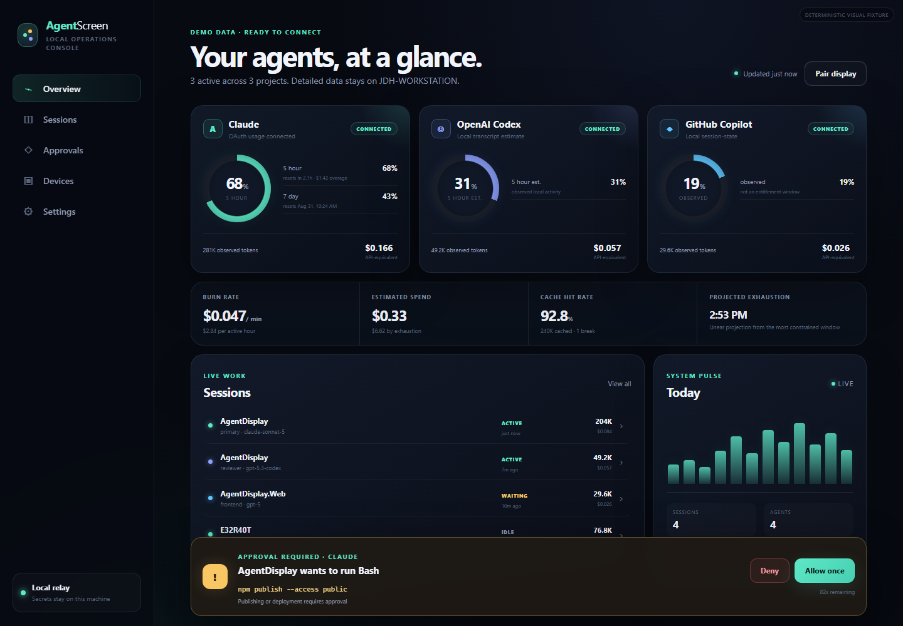
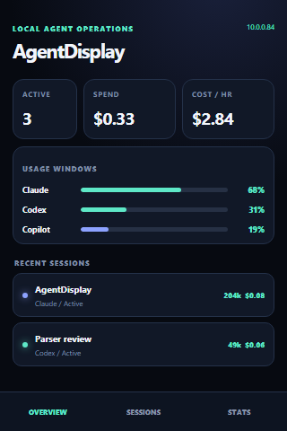

# AgentScreen

[](https://github.com/JerrettDavis/AgentScreen/actions/workflows/ci.yml)
[](https://github.com/JerrettDavis/AgentScreen/actions/workflows/codeql.yml)
[](LICENSE)
[](https://github.com/JerrettDavis/AgentScreen/releases)

AgentScreen is a local-first operations console for Claude Code, OpenAI Codex, and GitHub Copilot CLI. It combines a Blazor WebAssembly PWA, an ASP.NET Core host, lifecycle-hook gates, and a purpose-built 320×480 interface for the Hosyond/LCDWiki E32R40T ESP32 display.

The source retains the established `AgentDisplay.*` .NET namespaces, device protocol identifiers, and on-device provisioning name for compatibility. The public project and repository name is **AgentScreen**.



## Included in this alpha

- Incremental discovery and defensive parsing of local agent session files.
- A normalized model for sessions, projects, agents, turns, token classes, cache activity, costs, usage windows, and pending approvals.
- Dashboard metrics for spend, burn rate, active work, cache hits and breaks, and estimated exhaustion.
- Session and turn drill-downs in a responsive, installable Blazor PWA.
- Deterministic allow, ask, and deny policies delivered through provider lifecycle hooks.
- A safe hook installer with dry-run output, merge behavior, timestamped backups, and Windows/Linux/macOS paths.
- A compact redacted device protocol for the E32R40T.
- LAN, ESP32 SoftAP, and browser-mediated BLE snapshot transport.
- Automatic display synchronization with a browser-persisted 30-second, 1-minute, 5-minute, or 15-minute schedule.
- A 320×480 LVGL interface with overview, sessions, statistics, and full-screen approval prompts.
- Deterministic demo data and checked screenshots, so the application is useful before any agent directory is connected.

## Provider coverage

| Provider | Local session source | Hook gate | Usage coverage | Important note |
|---|---|---:|---|---|
| Claude Code | `~/.claude/projects/**/*.jsonl` | Yes | Optional reported 5-hour and 7-day windows, otherwise observed local usage | The reported-window collector is opt-in and keeps the local OAuth token on the host. |
| OpenAI Codex | `~/.codex/sessions/**/*.jsonl`, `~/.codex/history.jsonl` | Yes | Observed local usage | New or changed user hooks must be reviewed and trusted with `/hooks`. |
| GitHub Copilot CLI | `~/.copilot/session-state/*/events.jsonl` | Yes | Observed local usage | Cost is an API-equivalent estimate, not GitHub subscription billing. |

Local file formats and provider hook contracts can evolve. Parsers tolerate missing and renamed fields, and every usage window carries a source label. Locally observed activity is never presented as an authoritative entitlement window.

## Repository map

```text
src/                         .NET 10 host, core, contracts, and Blazor PWA
integrations/hooks/          Node hook relay and safe installer
firmware/e32r40t/            PlatformIO, LVGL, ST7796S, and XPT2046 firmware
firmware/e32r40t/test/       PlatformIO host-native framing/model test
tests/                       xUnit fixtures, Node integration tests, native C++ test
tools/design-preview/        dependency-free visual fixture used for screenshots
docs/screenshots/            checked desktop, mobile, detail, gate, and device views
```

## Start the host and PWA

Requirements:

- .NET SDK 10.0.303 or a compatible later .NET 10 feature band (as selected by `global.json`)
- Node.js 22 for hook installation and tests
- A current Chromium-based browser
- PlatformIO only when building or flashing the display

Run with deterministic sample data:

```bash
dotnet run --project src/AgentDisplay.Host -- --demo
```

Open `http://127.0.0.1:5277`. Remove `--demo` to scan the normal provider directories. Directory roots can be changed in **Settings** or `src/AgentDisplay.Host/appsettings.json`.

On the **Devices** page, enable automatic updates and choose a refresh interval. A snapshot is sent immediately after connection; subsequent updates use the selected schedule. If Bluetooth drops, AgentScreen retries once, clears stale GATT state, and presents reconnect/reset guidance instead of repeating raw browser errors.

The host listens on port 5277 on loopback and local network interfaces. Static PWA files can load from the LAN, but every non-loopback `/api` request requires the generated pairing key.

### Pair another browser

1. On the host machine, open `http://127.0.0.1:5277/devices`.
2. Copy the pairing key. It is also stored in `~/.agentdisplay/pairing-key`.
3. From another machine, open `http://HOST-IP:5277`.
4. The app redirects to `/pair`; paste the key.

The browser stores the key in `sessionStorage`, so closing that tab clears the trust grant. A key supplied as `?key=...` is moved into session storage and immediately removed from the address bar.

A remote page served over plain HTTP remains usable as a dashboard, but normal PWA installation and Web Bluetooth require a secure context. Localhost is treated as secure by modern browsers. Use trusted HTTPS when those capabilities are needed from another machine.

## Install agent hooks

Preview every change first:

```bash
node integrations/hooks/install.mjs --provider all --dry-run
node integrations/hooks/install.mjs --provider all --apply
```

The installer adds AgentDisplay entries without replacing existing hooks. Existing files receive timestamped backups. It writes to:

```text
Claude Code        ~/.claude/settings.json
OpenAI Codex       ~/.codex/hooks.json
GitHub Copilot CLI ~/.copilot/hooks/agentdisplay.json
```

Codex requires a one-time `/hooks` review after a new or changed hook definition is installed. Hook commands send redacted lifecycle events to `http://127.0.0.1:5277/api/v1/hooks/event`. The relay waits locally for an AgentDisplay `ask` decision and returns only a final provider-valid allow or deny response.

Environment overrides are documented in `integrations/hooks/README.md`.

## Flash the E32R40T

```bash
pio run -d firmware/e32r40t -e e32r40t -t upload
pio device monitor -d firmware/e32r40t
```

On first boot the display creates `AgentDisplay-XXXX` with a random WPA2 password shown on the screen and serial console. Join that network, open `http://192.168.4.1`, then enter:

- the normal Wi-Fi SSID and password, when available;
- a host URL reachable by the display, such as `http://192.168.1.20:5277`;
- the host pairing key from the PWA **Devices** page.

The SoftAP remains available for direct setup. Touch calibration values are board-family defaults and may need adjustment for an individual panel.



## Transport behavior

| Transport | Snapshot delivery | Approval return | Notes |
|---|---:|---:|---|
| Normal Wi-Fi | Pull or host push | Yes | Recommended. The device authenticates to the host with the pairing key. |
| Direct SoftAP | Host push or device pull across the direct subnet | Yes, when the host URL is reachable | This is the no-router mode. It replaces a Wi-Fi Direct assumption with ESP32 AP+STA support. |
| Web Bluetooth | Browser push | No, by itself | BLE is snapshot-only in this alpha. Physical allow/deny still requires the display to reach the host over Wi-Fi. |

The BLE characteristic is intentionally small and newline-framed. It transports only the compact redacted snapshot, not provider tokens or transcripts.

## Cost and forecast semantics

The catalog is versioned as of **2026-08-27**. Costs are token-based API-equivalent estimates unless a provider returns an authoritative monetary value. Copilot estimates use a proxy model price and must not be read as a Copilot invoice. Burn rate is based on recent parsed turns. Exhaustion is a linear projection from the most constrained reported usage window and is hidden when the data is insufficient.

## Validation

Run the complete local harness:

```bash
bash scripts/test-all.sh
python3 scripts/validate.py
node scripts/capture-screenshots.mjs
```

Individual commands:

```bash
node --test tests/js/*.test.mjs
dotnet test AgentDisplay.slnx --configuration Release
bash scripts/test-firmware-model.sh
pio test -d firmware/e32r40t -e native
pio run -d firmware/e32r40t -e e32r40t
```

`validation-report.json` is generated locally and uploaded as a CI artifact; it records exactly which checks ran without committing machine-specific paths. GitHub Actions builds and tests the .NET solution on Linux and Windows, cross-builds the PlatformIO firmware, runs CodeQL and dependency review, and packages tagged releases with SHA-256 checksums.

## Current limits

- This is `0.1.0-alpha.1`, not a signed desktop installer or firmware image release.
- Tagged releases are unsigned. Validate the published `SHA256SUMS` before running a downloaded host binary or flashing firmware.
- Provider-local schemas are best-effort integrations and may need adapter updates after provider releases.
- The host has no durable database yet. It rescans local files and keeps gates in memory.
- BLE has no application-layer pairing in this alpha and should be treated as a nearby display-push transport only.

MIT licensed; dependency attributions are in [THIRD_PARTY_NOTICES.md](THIRD_PARTY_NOTICES.md). Read `ARCHITECTURE.md`, `SECURITY.md`, `VALIDATION.md`, and `PLAN.md` before expanding the trust boundary. Contributors should also review [CONTRIBUTING.md](CONTRIBUTING.md), and users can start with [troubleshooting](docs/TROUBLESHOOTING.md).
